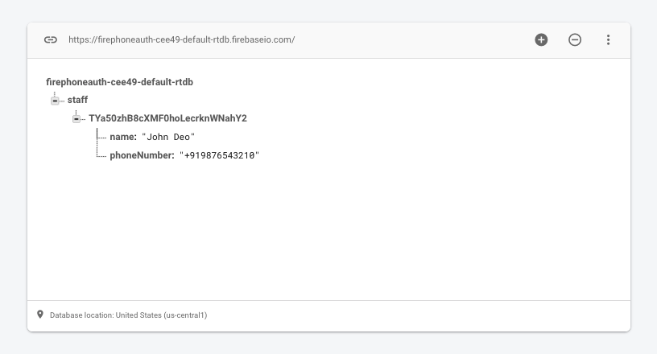
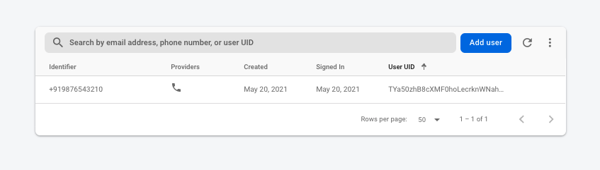

# fireauth-assignment
 
## Project Setup

* Clone project and execute `npm i`
* After finishing module installation execute `npx pod-install` or `cd ios && pod install`
* To run in ios execute `npm run ios` and to run in android `npm run android`

## Database Entries

## Phone Auth Data

## Working Video

This is the [Video](./workingvideo/auth_video.mov) you can download and view how the flow of assignment is.

## APK

* Click here to download [android application](./workingvideo/fire_auth.apk)

## How to Test

* Enter number which is not in database entries and check.
* Enter number which is in database entries and verify.
* Enter valid number which is in database and enter invalid code.